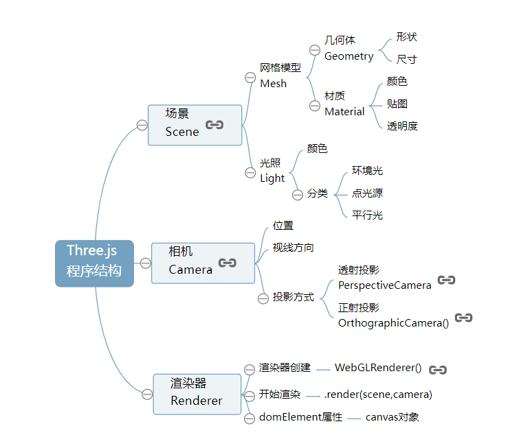
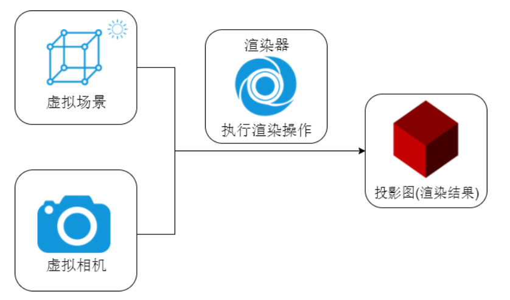

# three.js 简介

## three.js是什么

Three.js是基于原生WebGL封装运行的三维引擎，在所有WebGL引擎中，Three.js是国内文资料最多、使用最广泛的三维引擎。

## three.js的程序结构

## 场景——相机——渲染器

## 简单的demo示例
要创建一个WebGL程序，需要以下几个步骤
1. 初始化WebGL绘图上下文
2. 初始化着色器程序
3. 建立模型和数据缓存
4. 完成绘制和动画

而Three.js作为对WebGL的封装，其使用面向对象的方式来构建程序，包含3个基本对象： 场景（scene）, 相机（camera）, 以及一个渲染器（renderer）。拿电影来类比的话，场景对应于整个布景空间，相机是拍摄镜头，渲染器用来把拍摄好的场景转换成胶卷（对于网页来讲，是电脑屏幕）。

具体可查看本项目中的示例代码。

## 实际中的应用例子

### 物联网3D可视化
http://www.yanhuangxueyuan.com/3D/liangcang/index.html

### 产品在线预览
http://app.xuanke3d.com/apps/trayton/#/show

### WebVR

http://www.yanhuangxueyuan.com/3D/houseDesign/index.html

### 轻量级游戏

微信跳一跳、蚂蚁森林

### 结合物理引擎

结合cannon.js等物理引擎，更多的可能性
https://schteppe.github.io/cannon.js/examples/threejs_fps.html

## three.js文档

中文：http://www.yanhuangxueyuan.com/

英文：https://threejs.org/